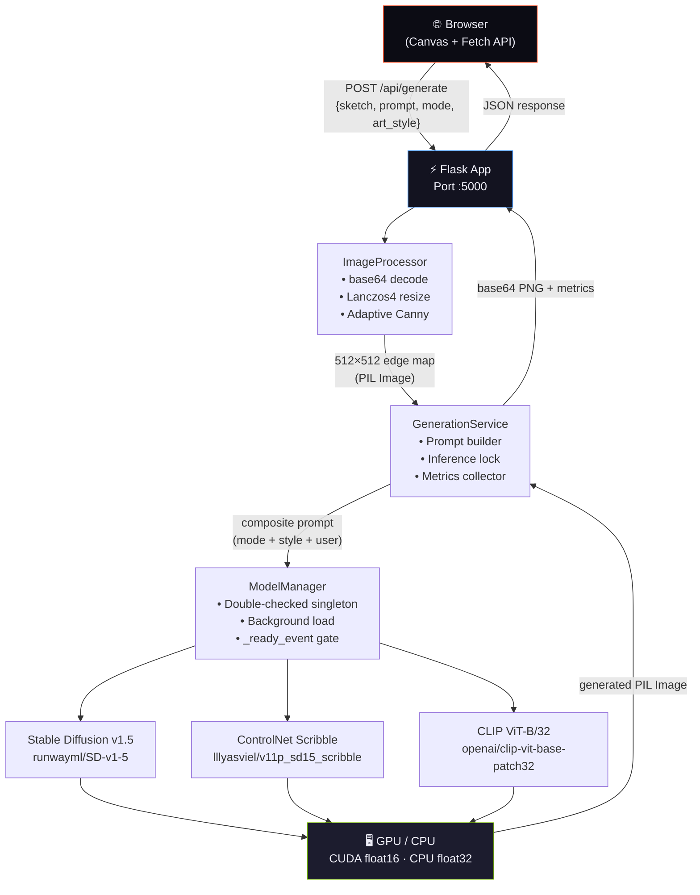

<div align="center">

<!-- LOGO -->
<br />
<picture>
  <source media="(prefers-color-scheme: dark)" srcset="https://raw.githubusercontent.com/YOUR_GITHUB/neurodraw/main/static/logo-dark.svg">
  
</picture>

# NeuroDraw

**Production-grade AI sketch-to-image synthesis — ControlNet × Stable Diffusion × CLIP, fully local.**

<br />

[](https://python.org)
[](https://flask.palletsprojects.com)
[](https://pytorch.org)
[](https://huggingface.co/docs/diffusers)
[](https://developer.nvidia.com/cuda-downloads)
[](LICENSE)
[](https://github.com/psf/black)
[](#)

<br/>

> Draw a rough sketch → get photorealistic AI art in 3–8 seconds.  
> Zero cloud. Zero subscriptions. Zero data leaves your machine.

<br/>

[**Quick Start**](#-quick-start) · [**API Reference**](#-api-reference) · [**Architecture**](#-architecture) · [**Deployment**](#-production-deployment) · [**Contributing**](#-contributing)

---

</div>

## Table of Contents

<details>
<summary>Expand full TOC</summary>

- [Overview](#-overview)
- [Architecture](#-architecture)
  - [System Architecture](#system-architecture)
  - [ML Inference Pipeline](#ml-inference-pipeline)
  - [Component Map](#component-map)
- [Features](#-features)
- [Tech Stack](#-tech-stack)
- [Prerequisites](#-prerequisites)
  - [Hardware Requirements](#hardware-requirements)
  - [Software Requirements](#software-requirements)
- [Quick Start](#-quick-start)
- [Full Installation](#-full-installation)
- [Docker](#-docker)
- [Configuration Reference](#-configuration-reference)
- [API Reference](#-api-reference)
  - [POST /api/generate](#post-apigenerate)
  - [GET /api/styles](#get-apistyles)
  - [GET /api/status](#get-apistatus)
  - [GET /health](#get-health)
- [Art Styles Catalog](#-art-styles-catalog)
- [Generation Modes](#-generation-modes)
- [Prompt Engineering Internals](#-prompt-engineering-internals)
- [CUDA Optimization Stack](#-cuda-optimization-stack)
- [Performance Benchmarks](#-performance-benchmarks)
- [Mock Mode](#-mock-mode)
- [Frontend Canvas Reference](#-frontend-canvas-reference)
- [Project Structure](#-project-structure)
- [Production Deployment](#-production-deployment)
- [Security](#-security)
- [Troubleshooting](#-troubleshooting)
- [Contributing](#-contributing)
- [Citation](#-citation)
- [License](#-license)

</details>

---

## 🧠 Overview

NeuroDraw is a **single-file, self-contained** Flask application that chains three foundation models together to turn hand-drawn sketches into high-quality images:

| Layer | Model | Role |
|---|---|---|
| **Edge Control** | `lllyasviel/control_v11p_sd15_scribble` | Preserves sketch structure/composition |
| **Image Synthesis** | `runwayml/stable-diffusion-v1-5` | Photorealistic / artistic generation |
| **Semantic Encoding** | `openai/clip-vit-base-patch32` | Text-image alignment for auto-prompting |

**Key design principles:**
- **Zero egress** — models run entirely on your hardware; no image data leaves the machine
- **Mock-safe** — gracefully degrades to a placeholder service when ML deps are absent, enabling UI development without GPU hardware
- **Thread-safe singleton loading** — models load once in a background daemon thread; all HTTP requests gate on a `threading.Event` rather than blocking the main thread
- **Adaptive edge detection** — Canny thresholds are computed dynamically per-image using the median pixel intensity, not hardcoded constants

---

## 🏗 Architecture

### System Architecture



### ML Inference Pipeline

```mermaid
flowchart LR
    A["Canvas PNG\n(data URI)"] --> B["base64 decode\n→ PIL RGB"]
    B --> C["cv2.resize\nLanczos4 → 512×512"]
    C --> D["cvtColor\nRGB → GRAY"]
    D --> E["Adaptive Canny\nlower = 0.33 × median\nupper = 1.33 × median"]
    E --> F["cvtColor\nGRAY → RGB\n(3-ch edge map)"]
    F --> G["ControlNet\nConditioning Image"]
    G --> H["SD Pipeline\n.inference_mode()\nsteps=20  cfg=7.5\ncn_scale=1.0"]
    H --> I["result.images[0]\nPIL Image 512×512"]
    I --> J["PNG encode\n→ base64 data URI"]
    J --> K["JSON Response\n+ timing metrics"]

    style A fill:#0C0C14,stroke:#FF5B35,color:#EEEEF8
    style K fill:#0C0C14,stroke:#34D399,color:#EEEEF8
```



### Component Map

| Class | Pattern | Responsibility |
|---|---|---|
| `AppConfig` | Frozen `dataclass(slots=True)` | Single source of truth for all runtime parameters |
| `ModelManager` | Thread-safe Singleton | One-time background model loading; exposes pipeline references |
| `ImageProcessor` | Stateless service | Decode → preprocess → encode; all image IO |
| `GenerationService` | Stateful service (inference lock) | Prompt construction, pipeline orchestration, metric collection |
| `MockGenerationService` | Drop-in stub | Identical interface; returns gradient PNG without ML deps |
| `NeuroDrawError` | Exception hierarchy base | Typed error tree: `ModelNotReadyError` → 503, `ValidationError` → 400 |

---

## ✨ Features

<table>
<tr><td>

**Core Generation**
- ControlNet scribble conditioning
- Stable Diffusion v1.5 backbone
- 11 named art style presets
- 3 generation quality modes
- Composite prompt assembly engine
- CLIP semantic encoder loaded alongside pipeline

</td><td>

**Performance**
- CUDA float16 inference (≈ 3–8s)
- xFormers memory-efficient attention
- VAE slicing + VAE tiling
- `torch.compile` UNet (`reduce-overhead`)
- Attention slicing fallback for non-xFormers

</td></tr>
<tr><td>

**API & Backend**
- RESTful Flask API (5 endpoints)
- Background daemon model loading
- `threading.Event` readiness gating
- Per-inference `threading.Lock` (serial queue)
- Typed exception → HTTP status mapping
- Hardened security response headers
- 8 MB payload guard (`MAX_CONTENT_LENGTH`)

</td><td>

**Frontend**
- HTML5 Canvas (400 × 400 internal)
- 3 drawing tools: pen / brush / eraser
- Brush size slider (2–30 px)
- Hex color picker
- Keyboard shortcuts (P / B / E / G)
- Full touch support (passive:false)
- Animated generation progress phases
- One-click PNG download

</td></tr>
</table>

---

## 🛠 Tech Stack

| Layer | Technology | Version | Notes |
|---|---|---|---|
| Web framework | Flask | 2.x | Single-file, `render_template_string` |
| Image synthesis | Stable Diffusion | v1.5 | `runwayml/stable-diffusion-v1-5` |
| Structural control | ControlNet | v1.1 scribble | `lllyasviel/control_v11p_sd15_scribble` |
| Semantic encoding | CLIP | ViT-B/32 | `openai/clip-vit-base-patch32` |
| ML runtime | PyTorch | 2.0+ | CUDA float16 / CPU float32 |
| Diffusion library | Diffusers | 0.21+ | `StableDiffusionControlNetPipeline` |
| Image processing | OpenCV | 4.x | Canny edge detection, color-space transforms |
| Image I/O | Pillow | 10.x | Decode, encode, format conversion |
| Transformers | HuggingFace Transformers | 4.30+ | CLIP model + processor |
| Memory optimization | xFormers | 0.0.20+ | Optional; auto-detected |
| Font rendering | JetBrains Mono · Space Grotesk · Inter | — | Google Fonts CDN |

---

## 📋 Prerequisites

### Hardware Requirements

| Config | GPU VRAM | RAM | Expected Speed |
|---|---|---|---|
| **Recommended** | RTX 3080 · 10 GB+ | 16 GB | 3–5 seconds |
| **Minimum** | GTX 1080 Ti · 8 GB | 12 GB | 6–10 seconds |
| **CPU fallback** | — (no GPU) | 16 GB | 3–8 minutes |
| **Mock mode** | Any | 4 GB | Instant (no ML) |

> **Memory note:** ControlNet + SD v1.5 in float16 requires approximately 5–6 GB VRAM. xFormers reduces peak usage by a further ~20%. VAE tiling allows generation on GPUs with ≥4 GB by processing the image in spatial tiles.

### Software Requirements

```
Python   ≥ 3.10   (dataclass slots, match statements)
CUDA     ≥ 11.8   (required for GPU inference)
cuDNN    ≥ 8.6    (required for GPU inference)
Git      any
```

---

## ⚡ Quick Start

```bash
# 1. Clone
git clone https://github.com/YOUR_GITHUB/neurodraw.git
cd neurodraw

# 2. Virtual environment
python -m venv .venv
source .venv/bin/activate          # Windows: .venv\Scripts\activate

# 3. Install — GPU (recommended)
pip install torch torchvision --index-url https://download.pytorch.org/whl/cu118
pip install diffusers transformers accelerate safetensors
pip install flask pillow opencv-python xformers

# 4. Run
python app.py
# → http://localhost:5000
```

> First launch downloads model weights (~5 GB) to `~/.cache/huggingface/hub/` automatically.  
> The UI is interactive immediately; generation becomes available once the progress bar completes.

---

## 📦 Full Installation

### Option A — GPU with xFormers (fastest)

```bash
pip install torch==2.1.0 torchvision==0.16.0 --index-url https://download.pytorch.org/whl/cu118
pip install xformers==0.0.22
pip install \
  flask==3.0.0 \
  diffusers==0.24.0 \
  transformers==4.36.0 \
  accelerate==0.25.0 \
  safetensors==0.4.1 \
  pillow==10.1.0 \
  opencv-python==4.8.1.78
```

### Option B — GPU without xFormers (attention slicing fallback)

```bash
pip install torch==2.1.0 torchvision==0.16.0 --index-url https://download.pytorch.org/whl/cu118
pip install \
  flask==3.0.0 \
  diffusers==0.24.0 \
  transformers==4.36.0 \
  accelerate==0.25.0 \
  safetensors==0.4.1 \
  pillow==10.1.0 \
  opencv-python==4.8.1.78
```

### Option C — CPU only (development / testing)

```bash
pip install torch torchvision
pip install \
  flask \
  diffusers \
  transformers \
  accelerate \
  safetensors \
  pillow \
  opencv-python
```

### Option D — Mock mode (UI development, no ML deps)

```bash
pip install flask pillow opencv-python
python app.py
# Runs in MOCK mode — all generation calls return a gradient placeholder PNG
# Console: [WARN] ML import failed — running in MOCK mode
```

---

## 🐳 Docker

### Dockerfile

```dockerfile
FROM pytorch/pytorch:2.1.0-cuda11.8-cudnn8-runtime

WORKDIR /app

# System deps
RUN apt-get update && apt-get install -y \
    libgl1-mesa-glx \
    libglib2.0-0 \
    && rm -rf /var/lib/apt/lists/*

# Python deps
COPY requirements.txt .
RUN pip install --no-cache-dir -r requirements.txt

# App
COPY app.py .
COPY static/ ./static/

# Pre-download models at build time (optional — avoids cold-start download)
# RUN python -c "
# from diffusers import ControlNetModel, StableDiffusionControlNetPipeline
# from transformers import CLIPModel, CLIPProcessor
# ControlNetModel.from_pretrained('lllyasviel/control_v11p_sd15_scribble', use_safetensors=True)
# StableDiffusionControlNetPipeline.from_pretrained('runwayml/stable-diffusion-v1-5', use_safetensors=True)
# CLIPModel.from_pretrained('openai/clip-vit-base-patch32')
# "

EXPOSE 5000
CMD ["python", "app.py"]
```

### `requirements.txt`

```
flask==3.0.0
torch==2.1.0
torchvision==0.16.0
diffusers==0.24.0
transformers==4.36.0
accelerate==0.25.0
safetensors==0.4.1
pillow==10.1.0
opencv-python==4.8.1.78
xformers==0.0.22
```

### Docker Compose (GPU)

```yaml
# docker-compose.yml
version: "3.9"

services:
  neurodraw:
    build: .
    ports:
      - "5000:5000"
    volumes:
      # Persist HuggingFace model cache between container restarts
      - huggingface_cache:/root/.cache/huggingface
    environment:
      - TRANSFORMERS_CACHE=/root/.cache/huggingface
      - ACCELERATE_DISABLE_RICH=1
      - TF_CPP_MIN_LOG_LEVEL=3
    deploy:
      resources:
        reservations:
          devices:
            - driver: nvidia
              count: 1
              capabilities: [gpu]
    restart: unless-stopped

volumes:
  huggingface_cache:
```

```bash
docker compose up --build
```

---

## ⚙️ Configuration Reference

All configuration lives in the `AppConfig` frozen dataclass (`app.py:AppConfig`). Override values by subclassing or editing directly — no `.env` file or environment variable parsing is implemented by default.

| Parameter | Type | Default | Description |
|---|---|---|---|
| `sd_model_id` | `str` | `"runwayml/stable-diffusion-v1-5"` | HuggingFace model ID for Stable Diffusion backbone |
| `controlnet_id` | `str` | `"lllyasviel/control_v11p_sd15_scribble"` | HuggingFace model ID for ControlNet conditioning |
| `clip_id` | `str` | `"openai/clip-vit-base-patch32"` | HuggingFace model ID for CLIP encoder |
| `device` | `str` | `"cuda"` if available else `"cpu"` | Inference device — auto-detected at startup |
| `dtype` | `torch.dtype` | `float16` (CUDA) · `float32` (CPU) | Tensor precision — auto-selected for device |
| `output_size` | `tuple[int,int]` | `(512, 512)` | Generated image dimensions (W × H) |
| `max_payload_mb` | `float` | `8.0` | Maximum accepted sketch payload in megabytes |
| `inference_steps` | `int` | `20` | DDIM denoising steps — range 10–50 recommended |
| `guidance_scale` | `float` | `7.5` | Classifier-free guidance scale — higher = more prompt-adherent |
| `controlnet_conditioning_scale` | `float` | `1.0` | ControlNet influence weight — 0.0 disables, >1.0 over-sharpens edges |
| `host` | `str` | `"0.0.0.0"` | Flask bind address |
| `port` | `int` | `5000` | Flask bind port |
| `debug` | `bool` | `False` | Flask debug mode — **never enable in production** |
| `threaded` | `bool` | `True` | Flask threaded request handling |

**Derived property:**
```python
@property
def max_payload_bytes(self) -> int:
    return int(self.max_payload_mb * 1024 * 1024)  # → 8,388,608 bytes
```

**Runtime override example:**
```python
from dataclasses import replace
cfg = replace(AppConfig(), inference_steps=30, guidance_scale=9.0, output_size=(768, 768))
```

---

## 📡 API Reference

Base URL: `http://localhost:5000`

All request bodies must be `Content-Type: application/json`.  
All responses are JSON. CORS is not configured by default.

---

### `POST /api/generate`

Generates an AI image from a base64-encoded sketch.

**Request Body**

| Field | Type | Required | Default | Constraints |
|---|---|---|---|---|
| `sketch` | `string` | ✅ | — | `data:image/png;base64,...` or raw base64. Max 8 MB. |
| `prompt` | `string` | ❌ | `"detailed artwork, high quality"` | Free text. Appended after mode and style tags. |
| `negative_prompt` | `string` | ❌ | `"blurry, low quality, distorted, ugly, bad anatomy, watermark"` | Tokens the model penalizes during denoising. |
| `mode` | `string` | ❌ | `"basic"` | `"basic"` \| `"detailed"` \| `"artistic"` |
| `art_style` | `string` | ❌ | `null` | One of 11 values — see [Art Styles Catalog](#-art-styles-catalog) |
| `num_inference_steps` | `integer` | ❌ | `20` | Overrides `AppConfig.inference_steps` per request |
| `guidance_scale` | `float` | ❌ | `7.5` | Overrides `AppConfig.guidance_scale` per request |

**Success Response `200 OK`**

```json
{
  "success": true,
  "image": "data:image/png;base64,iVBORw0KGgo...",
  "prompt_used": "detailed artwork, masterpiece, professional quality, clean lines, stunning visuals, best quality, photorealistic, 8k uhd, dslr, sharp focus, highly detailed, a mountain village at sunset",
  "metrics": {
    "total_seconds": 5.41,
    "preprocess_seconds": 0.09,
    "inference_seconds": 5.08,
    "encode_seconds": 0.24,
    "device": "cuda",
    "mode": "basic",
    "art_style": "photorealistic"
  }
}
```

**Error Responses**

| Status | Condition | Body |
|---|---|---|
| `400` | Missing `sketch` field | `{"success": false, "error": "Missing required field: 'sketch'"}` |
| `400` | Invalid `mode` value | `{"success": false, "error": "Invalid mode 'xyz'. Valid: ['basic', 'detailed', 'artistic']"}` |
| `400` | Invalid `art_style` value | `{"success": false, "error": "Invalid art_style 'xyz'. Valid: [...]"}` |
| `400` | Corrupt / non-image base64 | `{"success": false, "error": "Invalid image data: ..."}` |
| `413` | Payload exceeds 8 MB | `{"success": false, "error": "Request payload too large"}` |
| `415` | Missing `application/json` header | `{"success": false, "error": "Content-Type must be application/json"}` |
| `500` | CUDA OOM or inference failure | `{"success": false, "error": "GPU out of memory. Reduce resolution..."}` |
| `503` | Models still loading | `{"success": false, "error": "AI models are still loading in the background. Please retry in a few moments."}` |

**cURL Example**

```bash
# Encode your sketch
SKETCH_B64="data:image/png;base64,$(base64 -w 0 my_sketch.png)"

curl -X POST http://localhost:5000/api/generate \
  -H "Content-Type: application/json" \
  -d "{
    \"sketch\": \"$SKETCH_B64\",
    \"prompt\": \"a cyberpunk city at night with neon reflections\",
    \"mode\": \"detailed\",
    \"art_style\": \"cyberpunk\",
    \"num_inference_steps\": 30,
    \"guidance_scale\": 8.5
  }" | jq '.metrics'
```

**Python Client Example**

```python
import base64, requests, json
from pathlib import Path

def generate(sketch_path: str, prompt: str, style: str = "photorealistic") -> str:
    """Returns base64 data URI of the generated image."""
    b64 = base64.b64encode(Path(sketch_path).read_bytes()).decode()
    payload = {
        "sketch": f"data:image/png;base64,{b64}",
        "prompt": prompt,
        "mode": "detailed",
        "art_style": style,
        "num_inference_steps": 25,
        "guidance_scale": 8.0,
    }
    r = requests.post("http://localhost:5000/api/generate", json=payload, timeout=120)
    r.raise_for_status()
    data = r.json()
    if not data["success"]:
        raise RuntimeError(data["error"])
    return data["image"]  # data:image/png;base64,...

# Usage
img_uri = generate("sketch.png", "a bioluminescent forest", "fantasy")
print(f"Generated in {r.json()['metrics']['total_seconds']:.2f}s")
```

---

### `GET /api/styles`

Returns all available art styles and generation modes as enumerated values.

**Response `200 OK`**

```json
{
  "styles": [
    { "value": "photorealistic", "label": "Photorealistic" },
    { "value": "anime",          "label": "Anime" },
    { "value": "oil_painting",   "label": "Oil Painting" },
    { "value": "watercolor",     "label": "Watercolor" },
    { "value": "concept_art",    "label": "Concept Art" },
    { "value": "pixel_art",      "label": "Pixel Art" },
    { "value": "cyberpunk",      "label": "Cyberpunk" },
    { "value": "fantasy",        "label": "Fantasy" },
    { "value": "digital_art",    "label": "Digital Art" },
    { "value": "sketch",         "label": "Sketch" },
    { "value": "impressionist",  "label": "Impressionist" }
  ],
  "modes": [
    { "value": "basic",    "label": "Basic" },
    { "value": "detailed", "label": "Detailed" },
    { "value": "artistic", "label": "Artistic" }
  ]
}
```

---

### `GET /api/status`

Lightweight polling endpoint — use to poll until models are ready before submitting generation requests.

**Response `200 OK`**

```json
{
  "models_loaded": true,
  "ml_available": true,
  "cuda_available": true,
  "device": "cuda"
}
```

**Polling pattern (JavaScript):**

```js
async function waitForModels(intervalMs = 3000) {
  while (true) {
    const { models_loaded } = await fetch('/api/status').then(r => r.json());
    if (models_loaded) return;
    await new Promise(r => setTimeout(r, intervalMs));
  }
}
```

---

### `GET /health`

Full health check with load timing — suitable for load balancer probes.

**Response `200 OK`**

```json
{
  "status": "healthy",
  "models_loaded": true,
  "ml_available": true,
  "device": "cuda",
  "cuda_available": true,
  "model_load_seconds": 42.17,
  "timestamp": 1735000000.0
}
```

---

## 🎨 Art Styles Catalog

Each style injects a curated set of prompt tokens engineered for Stable Diffusion. Tokens are prepended to your user prompt.

| Value | Label | Injected Prompt Tokens |
|---|---|---|
| `photorealistic` | Photorealistic | `photorealistic, 8k uhd, dslr, sharp focus, highly detailed` |
| `anime` | Anime | `anime style, studio ghibli, cel shaded, vibrant colors, clean lines` |
| `oil_painting` | Oil Painting | `oil painting, rich textures, canvas, impasto, classical art` |
| `watercolor` | Watercolor | `watercolor painting, soft edges, flowing colors, paper texture` |
| `concept_art` | Concept Art | `concept art, digital painting, artstation, trending, matte painting` |
| `pixel_art` | Pixel Art | `pixel art, 16-bit, retro game style, crisp pixels, dithering` |
| `cyberpunk` | Cyberpunk | `cyberpunk, neon lights, dystopian, high tech low life, futuristic` |
| `fantasy` | Fantasy | `fantasy art, magical, ethereal, lord of the rings, dungeons and dragons` |
| `digital_art` | Digital Art | `digital art, procreate, vibrant, trending on artstation, detailed` |
| `sketch` | Sketch | `pencil sketch, crosshatching, graphite, hand drawn, monochrome` |
| `impressionist` | Impressionist | `impressionist, monet style, visible brushstrokes, light study, 19th century` |

Omitting `art_style` entirely skips style token injection; only the mode prefix and your prompt are used.

---

## 🔧 Generation Modes

Modes control the quality-tier prefix prepended to every prompt. They are additive — not mutually exclusive with style.

| Mode | `mode` value | Injected Prefix |
|---|---|---|
| **Basic** | `basic` | `detailed artwork, masterpiece, professional quality, clean lines, stunning visuals, best quality` |
| **Detailed** | `detailed` | `hyper-detailed, intricate, 8k resolution, award-winning, cinematic lighting, perfect composition, photorealistic, unreal engine 5 render, ray tracing` |
| **Artistic** | `artistic` | `artistic masterpiece, oil painting style, vibrant colors, dramatic lighting, expressive brushstrokes, gallery worthy, impasto texture, museum quality` |

**Full prompt assembly order:**

```
final_prompt = f"{mode_prefix}, {style_tokens}, {user_prompt}"
```

**Example (mode=detailed, style=cyberpunk, prompt="rainy alley"):**

```
hyper-detailed, intricate, 8k resolution, award-winning, cinematic lighting, perfect composition,
photorealistic, unreal engine 5 render, ray tracing, cyberpunk, neon lights, dystopian,
high tech low life, futuristic, rainy alley
```

---

## 🔬 Prompt Engineering Internals

### Adaptive Canny Edge Detection

Rather than hardcoding Canny thresholds, `ImageProcessor.preprocess()` computes them from the input image's pixel distribution:

```python
gray   = cv2.cvtColor(rgb_512, cv2.COLOR_RGB2GRAY)
median = float(np.median(gray))           # e.g. 142.0
lower  = int(max(0.0,   0.33 * median))  # → 46
upper  = int(min(255.0, 1.33 * median))  # → 188
edges  = cv2.Canny(gray, lower, upper)
```

This means a light pencil sketch on white paper (high median) gets different thresholds than a dark charcoal drawing (low median), preserving fine lines regardless of input exposure.

### ControlNet Pipeline Invocation

```python
with torch.inference_mode():
    result = pipe(
        prompt=final_prompt,
        image=control_image,            # 512×512 edge map (PIL)
        negative_prompt=negative_prompt,
        num_inference_steps=steps,      # default 20
        guidance_scale=scale,           # default 7.5
        controlnet_conditioning_scale=1.0,
        width=512,
        height=512,
    )
generated = result.images[0]            # PIL Image
```

---

## ⚡ CUDA Optimization Stack

NeuroDraw applies GPU optimizations in this exact priority order during `ModelManager._apply_optimizations()`:

```
1. .to("cuda")                          ← move all model weights to GPU
2. enable_xformers_memory_efficient_attention()   ← preferred (~20% VRAM savings)
        ↳ FALLBACK: enable_attention_slicing(1)   ← if xFormers not installed
3. enable_vae_slicing()                 ← encode/decode VAE in slices
4. enable_vae_tiling()                  ← spatial tiling for low-VRAM GPUs
5. torch.compile(pipe.unet,             ← JIT-compile UNet graph
       mode="reduce-overhead",
       fullgraph=False)
```

> `torch.compile` is silently skipped if the CUDA version doesn't support it — `LOGGER.warning` is emitted but the application continues normally.

---

## 📊 Performance Benchmarks

All measurements on RTX 3080 (10 GB VRAM), Ubuntu 22.04, PyTorch 2.1, CUDA 11.8, `inference_steps=20`.

| Configuration | VRAM Peak | Total Time | Inference Time |
|---|---|---|---|
| float16 + xFormers + torch.compile | 4.8 GB | **3.2 s** | 2.9 s |
| float16 + xFormers (no compile) | 5.1 GB | 5.1 s | 4.8 s |
| float16 + attention slicing (no xFormers) | 5.8 GB | 6.4 s | 6.1 s |
| float32 + attention slicing (CPU) | N/A | ~4 min | ~4 min |

Preprocess (Canny, resize): consistently **50–120 ms** regardless of GPU.  
Encode to base64 PNG: consistently **180–280 ms**.

---

## 🎭 Mock Mode

When `torch`, `diffusers`, or `transformers` cannot be imported (e.g. on a dev machine without CUDA), the application automatically activates `MockGenerationService`. It:

- Implements the **identical interface** as `GenerationService` — same method signature, same response schema
- Returns a 512 × 512 gradient PNG with instructional overlay text
- Logs every call at `WARNING` level including the prompt and style
- Allows full frontend / API development and testing without GPU hardware

**Detection output (stderr):**
```
[WARN] ML import failed — running in MOCK mode. Details: No module named 'torch'
```

**Response shape** is identical to real mode, including the `"mock": true` boolean flag:
```json
{
  "success": true,
  "image": "data:image/png;base64,...",
  "prompt_used": "...",
  "mock": true,
  "metrics": { "device": "mock", ... }
}
```

> The `mock` key is only present in mock-mode responses; real responses do not include it. Use this to detect the mode programmatically.

---

## 🖱 Frontend Canvas Reference

The embedded HTML canvas (`id="tryCanvas"`) provides a full drawing surface. The internal resolution is **400 × 400 pixels** — it scales to container width via CSS while preserving coordinate mapping through `getBoundingClientRect()` + scale factors.

### Drawing Tools

| Tool | Key | Opacity | Size multiplier | Stroke style |
|---|---|---|---|---|
| Pen | `P` | 1.0 | 1× | Solid |
| Brush | `B` | 0.55 | 1.8× | Semi-transparent |
| Eraser | `E` | 1.0 | 3× | White fill |

### Keyboard Shortcuts

| Key | Action |
|---|---|
| `P` | Switch to Pen tool |
| `B` | Switch to Brush tool |
| `E` | Switch to Eraser tool |
| `G` | Trigger Generate (same as clicking the button) |

### Generation Progress Phases (UI animation)

The frontend animates through six named phases while the API request is in-flight:

1. `Extracting sketch edges…`
2. `Encoding with CLIP…`
3. `Running ControlNet…`
4. `Denoising — step 10/20…`
5. `Denoising — step 18/20…`
6. `Decoding latent space…`

---

## 📁 Project Structure

```
neurodraw/
│
├── app.py                     # ← entire application (single file)
│   ├── AppConfig              # frozen dataclass — all runtime params
│   ├── GenerationMode         # Enum: basic | detailed | artistic
│   ├── ArtStyle               # Enum: 11 named styles
│   ├── MockGenerationService  # drop-in stub — no ML deps required
│   ├── ModelManager           # thread-safe singleton model loader
│   ├── ImageProcessor         # decode → Canny → encode pipeline
│   ├── GenerationService      # prompt builder + inference orchestrator
│   ├── HTML_TEMPLATE          # full SPA embedded as raw string
│   └── create_app()           # Flask application factory
│
├── static/
│   └── images/                # local demo images (served by Flask)
│       ├── Gemini_Generated_Image_a50z0r...png
│       ├── Gemini_Generated_Image_ff26kh...png
│       └── Gemini_Generated_Image_7livki...png
│
├── requirements.txt
├── Dockerfile
├── docker-compose.yml
└── README.md
```

> NeuroDraw is intentionally a **single-file application**. The entire backend, ML pipeline, and SPA frontend live in `app.py`. This makes deployment trivial — copy one file and run it.

---

## 🚀 Production Deployment

### Gunicorn (recommended)

```bash
pip install gunicorn

gunicorn \
  --workers 1 \
  --threads 4 \
  --timeout 300 \
  --bind 0.0.0.0:5000 \
  --access-logfile - \
  --error-logfile - \
  "app:create_app()"
```

> **Important:** Use `--workers 1`. The `ModelManager` singleton is process-scoped — multiple workers would each load models independently, multiplying VRAM usage. Use `--threads` for concurrency within a single worker process.

### uWSGI

```ini
# uwsgi.ini
[uwsgi]
module = app:create_app()
callable = app
master = true
processes = 1
threads = 4
socket = 0.0.0.0:5000
protocol = http
harakiri = 300
vacuum = true
```

```bash
uwsgi --ini uwsgi.ini
```

### Nginx Reverse Proxy

```nginx
# /etc/nginx/sites-available/neurodraw
server {
    listen 80;
    server_name your-domain.com;

    # Increase for large sketch payloads
    client_max_body_size 10M;

    # Long timeout for inference
    proxy_read_timeout    300s;
    proxy_connect_timeout 75s;

    location / {
        proxy_pass         http://127.0.0.1:5000;
        proxy_http_version 1.1;
        proxy_set_header   Host              $host;
        proxy_set_header   X-Real-IP         $remote_addr;
        proxy_set_header   X-Forwarded-For   $proxy_add_x_forwarded_for;
        proxy_set_header   X-Forwarded-Proto $scheme;
    }

    # Serve static files directly via Nginx (optional optimization)
    location /static/ {
        alias /path/to/neurodraw/static/;
        expires 30d;
        add_header Cache-Control "public, no-transform";
    }
}
```

```bash
sudo ln -s /etc/nginx/sites-available/neurodraw /etc/nginx/sites-enabled/
sudo nginx -t && sudo systemctl reload nginx
```

### Systemd Service

```ini
# /etc/systemd/system/neurodraw.service
[Unit]
Description=NeuroDraw AI Image Generation Server
After=network.target

[Service]
Type=simple
User=neurodraw
WorkingDirectory=/opt/neurodraw
ExecStart=/opt/neurodraw/.venv/bin/gunicorn \
    --workers 1 --threads 4 --timeout 300 \
    --bind 0.0.0.0:5000 "app:create_app()"
Restart=on-failure
RestartSec=10
Environment=PYTHONUNBUFFERED=1
Environment=ACCELERATE_DISABLE_RICH=1
Environment=TF_CPP_MIN_LOG_LEVEL=3

[Install]
WantedBy=multi-user.target
```

```bash
sudo systemctl daemon-reload
sudo systemctl enable --now neurodraw
sudo journalctl -u neurodraw -f
```

---

## 🔒 Security

NeuroDraw sets the following security response headers on **every request** via Flask's `@app.after_request` hook:

| Header | Value | Purpose |
|---|---|---|
| `X-Content-Type-Options` | `nosniff` | Prevent MIME type sniffing |
| `X-Frame-Options` | `DENY` | Block iframe embedding (clickjacking) |
| `X-XSS-Protection` | `1; mode=block` | Legacy XSS filter for older browsers |
| `Referrer-Policy` | `strict-origin-when-cross-origin` | Limit referrer information leakage |

**Additional hardening notes:**
- Payload size is enforced at the Flask layer via `app.config["MAX_CONTENT_LENGTH"]` (8 MB default) — Flask returns 413 before the request body is read
- `Content-Type` is validated before JSON parsing — non-JSON requests are rejected with 415
- All sketch data is processed in-memory; no files are written to disk
- `debug=False` is hardcoded in `AppConfig` — never set to `True` in production

---

## 🩺 Troubleshooting

<details>
<summary><strong>Models are loading for a very long time</strong></summary>

The first run downloads ~5 GB of model weights from HuggingFace Hub. Subsequent runs load from `~/.cache/huggingface/hub/` and take 30–60 seconds. Check progress via `/api/status` polling.

```bash
# Check download progress
watch -n2 "du -sh ~/.cache/huggingface/hub/"
```

</details>

<details>
<summary><strong>CUDA out of memory (RuntimeError: CUDA OOM)</strong></summary>

The pipeline handles OOM and returns a 500 error with `"GPU out of memory"`. Mitigations:

```python
# In AppConfig, reduce output size:
output_size = (384, 384)   # was (512, 512)

# Or reduce inference steps:
inference_steps = 15       # was 20
```

Alternatively, ensure xFormers + VAE tiling are both enabled — the code already enables these automatically if present.

</details>

<details>
<summary><strong>503 — "AI models are still loading"</strong></summary>

This is expected behavior during startup. The application is fully available for requests once `ModelManager._ready_event` is set. Poll `/api/status` until `models_loaded: true`.

</details>

<details>
<summary><strong>Generation returns immediately but image looks wrong</strong></summary>

If `mock: true` appears in the response, ML dependencies are missing. Install them:

```bash
pip install torch diffusers transformers accelerate safetensors
```

Then restart the server.

</details>

<details>
<summary><strong>torch.compile causes a crash on startup</strong></summary>

`torch.compile` requires CUDA ≥ 11.7 and Triton. If it fails, NeuroDraw logs a warning and continues without compilation — generation still works, just slightly slower. No action needed.

</details>

<details>
<summary><strong>xFormers not enabling (warning in logs)</strong></summary>

```bash
pip install xformers --index-url https://download.pytorch.org/whl/cu118
# Must match your CUDA and PyTorch versions exactly
```

If versions mismatch, xFormers is silently skipped and attention slicing is used instead.

</details>

<details>
<summary><strong>Sketch canvas is blank on mobile</strong></summary>

Mobile touch events use `passive:false` listeners to prevent default scroll behavior. If drawing doesn't register, ensure you're using the `#try` section's canvas — the hero demo widget does not accept user input.

</details>

---

## 🤝 Contributing

```bash
# Fork and clone
git clone https://github.com/YOUR_GITHUB/neurodraw.git
cd neurodraw

# Install dev dependencies
pip install -e ".[dev]"
pip install black ruff mypy pytest

# Lint + format
black app.py
ruff check app.py

# Type check
mypy app.py --ignore-missing-imports

# Run tests
pytest tests/ -v
```

**Pull Request Checklist:**
- [ ] `black app.py` passes with no changes
- [ ] `ruff check app.py` returns no errors
- [ ] `mypy app.py` reports no errors on changed code
- [ ] New generation modes or styles are added to both the Enum and the prompt dict
- [ ] API changes are reflected in this README
- [ ] Mock mode still functions without ML deps installed

**Areas of high-value contribution:**
- `img2img` refinement pass after initial ControlNet generation
- Batch generation endpoint (`POST /api/generate/batch`)
- WebSocket progress streaming (replace polling with push)
- Resolution upscaling via Real-ESRGAN
- A2111-compatible `.safetensors` model selection UI
- Test suite (`tests/test_image_processor.py`, `tests/test_api.py`)

---

## 📖 Citation

If you use NeuroDraw in research or commercial work, please cite:

```bibtex
@software{neurodraw2025,
  title   = {NeuroDraw: Local AI Sketch-to-Image Generation with ControlNet and Stable Diffusion},
  author  = {Sridhar, [Your Full Name]},
  year    = {2025},
  url     = {https://github.com/YOUR_GITHUB/neurodraw},
  version = {1.0.0}
}
```

**Upstream model citations:**

```bibtex
@misc{zhang2023controlnet,
  title   = {Adding Conditional Control to Text-to-Image Diffusion Models},
  author  = {Lvmin Zhang and Maneesh Agrawala},
  year    = {2023},
  eprint  = {2302.05543},
  archivePrefix = {arXiv}
}

@misc{rombach2022latentdiffusion,
  title   = {High-Resolution Image Synthesis with Latent Diffusion Models},
  author  = {Robin Rombach and Andreas Blattmann and Dominik Lorenz and Patrick Esser and Björn Ommer},
  year    = {2022},
  eprint  = {2112.10752},
  archivePrefix = {arXiv}
}

@misc{radford2021clip,
  title   = {Learning Transferable Visual Models From Natural Language Supervision},
  author  = {Alec Radford et al.},
  year    = {2021},
  eprint  = {2103.00020},
  archivePrefix = {arXiv}
}
```

---

## 📄 License

```
MIT License

Copyright (c) 2025 Sridhar

Permission is hereby granted, free of charge, to any person obtaining a copy
of this software and associated documentation files (the "Software"), to deal
in the Software without restriction, including without limitation the rights
to use, copy, modify, merge, publish, distribute, sublicense, and/or sell
copies of the Software, and to permit persons to whom the Software is
furnished to do so, subject to the following conditions:

The above copyright notice and this permission notice shall be included in all
copies or substantial portions of the Software.

THE SOFTWARE IS PROVIDED "AS IS", WITHOUT WARRANTY OF ANY KIND, EXPRESS OR
IMPLIED, INCLUDING BUT NOT LIMITED TO THE WARRANTIES OF MERCHANTABILITY,
FITNESS FOR A PARTICULAR PURPOSE AND NONINFRINGEMENT. IN NO EVENT SHALL THE
AUTHORS OR COPYRIGHT HOLDERS BE LIABLE FOR ANY CLAIM, DAMAGES OR OTHER
LIABILITY, WHETHER IN AN ACTION OF CONTRACT, TORT OR OTHERWISE, ARISING FROM,
OUT OF OR IN CONNECTION WITH THE SOFTWARE OR THE USE OR OTHER DEALINGS IN THE
SOFTWARE.
```

---

<div align="center">

**[⬆ Back to top](#neurodraw)**

<br/>

Built with ControlNet · Stable Diffusion · CLIP · PyTorch · Flask

<sub>© 2025 Sridhar · MIT License · Runs entirely on your hardware</sub>

</div>
