<div align="center">
  
</div>

<br/>

<div align="center">

[](https://python.org)
[](https://pytorch.org)
[](https://flask.palletsprojects.com)
[](https://developer.nvidia.com)
[](https://docker.com)
[](LICENSE)
[](https://huggingface.co/docs/diffusers)

<br/>

**Draw anything. NeuroDraw renders it into photorealistic AI art — in seconds, on your own hardware.**

*ControlNet preserves your sketch structure. Stable Diffusion fills in the reality. CLIP understands the semantics.*
*No cloud. No subscriptions. No data leaves your machine.*

<br/>

[**Getting Started**](#-getting-started) &ensp;·&ensp; [**Architecture**](#-system-architecture) &ensp;·&ensp; [**API Reference**](#-api-reference) &ensp;·&ensp; [**Pipeline Internals**](#-pipeline-internals) &ensp;·&ensp; [**Deploy**](#-production-deployment) &ensp;·&ensp; [**Roadmap**](#-roadmap)

</div>

---

## 🎬 Live Demo

<div align="center">

<video src="images/Video Project.mp4" width="100%" autoplay loop muted playsinline></video>

</div>

---

## 🖼 What It Does

<table>
<tr>
<td align="center" width="33%">

**✏️ You Draw**

Rough scribble, precise line art,<br/>or anything in between.

</td>
<td align="center" width="4%">→</td>
<td align="center" width="33%">

**⚡ ControlNet Processes**

Extracts edge map via adaptive<br/>Canny · respects your composition.

</td>
<td align="center" width="4%">→</td>
<td align="center" width="26%">

**🎨 SD Renders**

Stable Diffusion synthesizes<br/>the final image in 3–8 seconds.

</td>
</tr>
</table>

<br/>

<div align="center">

<h3>Before → After</h3>

<table>
  <thead>
    <tr>
      <th align="center">Sketch</th>
      <th align="center">Photorealistic</th>
      <th align="center">Cyberpunk</th>
      <th align="center">Fantasy</th>
    </tr>
  </thead>
  <tbody>
    <tr>
      <td align="center"></td>
      <td align="center"></td>
      <td align="center">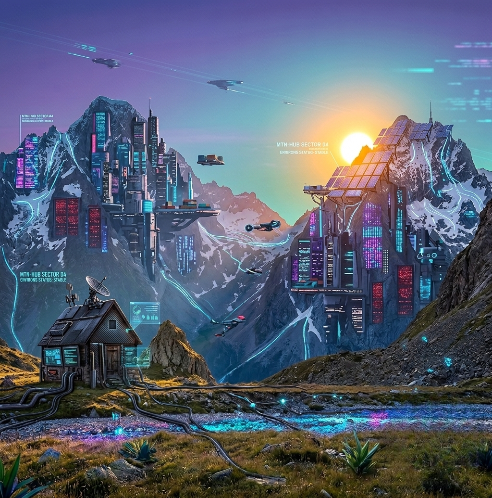</td>
      <td align="center">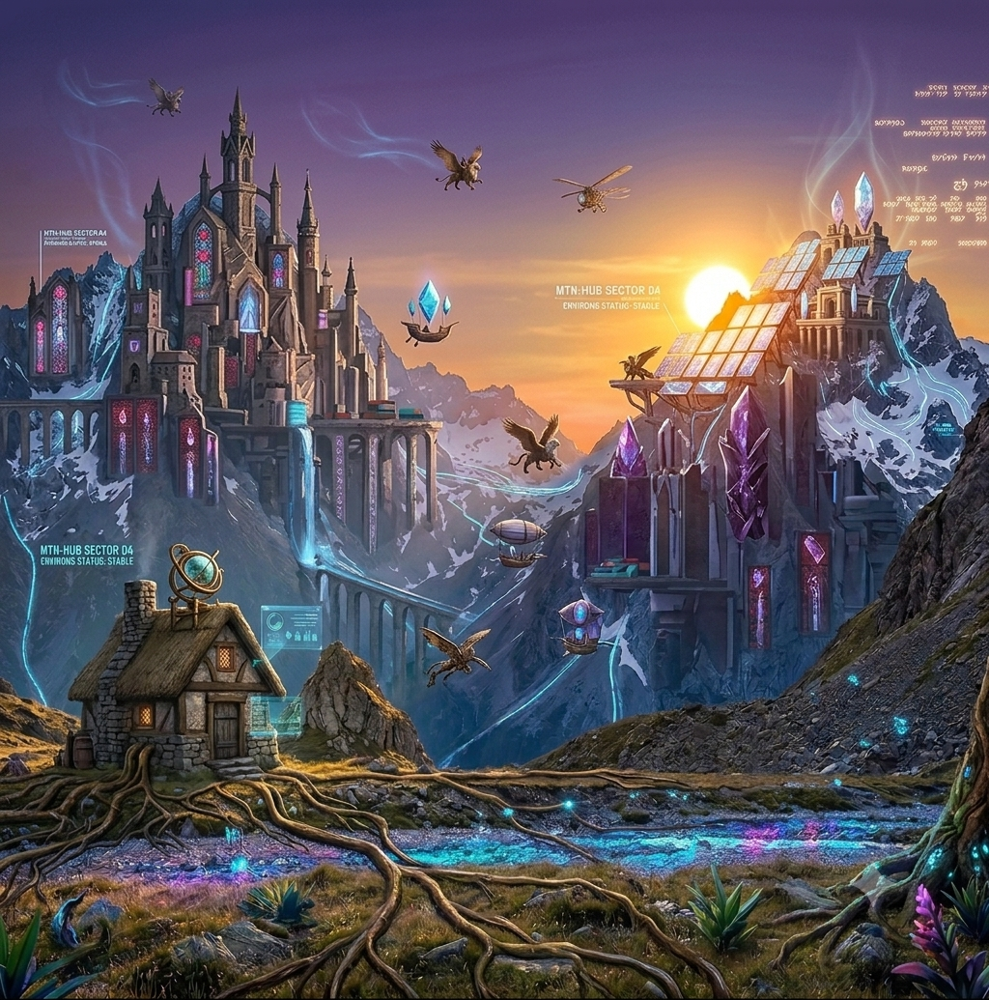</td>
    </tr>
    <tr>
      <td align="center"><code>style: sketch</code></td>
      <td align="center"><code>style: photorealistic</code></td>
      <td align="center"><code>style: cyberpunk</code></td>
      <td align="center"><code>style: fantasy</code></td>
    </tr>
  </tbody>
</table>

</div>

---

## ✦ Features

<table>
<tr>
<td>

### 🎯 Core Pipeline
- **ControlNet scribble** conditioning — your sketch is the blueprint, not a suggestion
- **Stable Diffusion v1.5** backbone with DDIM sampler
- **Adaptive Canny** edge detection (thresholds computed per-image from pixel median)
- **CLIP ViT-B/32** loaded alongside the pipeline for semantic alignment and auto-prompting
- **11 art style presets**, 3 quality modes, fully composable prompts

</td>
<td>

### ⚡ Performance
- CUDA **float16** inference — ~3–8s on RTX 3080
- **xFormers** memory-efficient attention (auto-detected, graceful fallback)
- **VAE slicing + tiling** for low-VRAM GPUs (≥4 GB)
- `torch.compile(unet, mode="reduce-overhead")` — JIT graph optimization
- Attention slicing fallback for CPU / non-xFormers environments

</td>
</tr>
<tr>
<td>

### 🛡 Production-Grade Backend
- Thread-safe **singleton ModelManager** (double-checked locking)
- Background daemon thread load — **UI ready before models finish**
- `threading.Lock` inference queue — safe under concurrent requests
- Typed exception hierarchy → precise HTTP status codes (400/413/415/503/500)
- **8 MB payload guard**, 4 hardened security response headers
- **Mock mode** — full UI + API works without any ML dependencies
- Structured logging with per-stage timing instrumentation

</td>
<td>

### 🖱 Built-in Canvas UI
- HTML5 Canvas, 400×400 internal resolution
- **3 tools:** Pen · Brush (α=0.55) · Eraser (3× size)
- Brush size slider (2–30 px) + hex color picker
- **Keyboard shortcuts:** `P` pen · `B` brush · `E` eraser · `G` generate
- Full **touch support** (`passive:false` touch events)
- Animated 6-phase generation progress display
- One-click PNG download of generated result

</td>
</tr>
</table>

---

## 📦 Tech Stack

<div align="center">

| Layer | Technology | Version | Model / ID |
|---|---|:---:|---|
| 🧠 Image Synthesis | Stable Diffusion | v1.5 | `runwayml/stable-diffusion-v1-5` |
| 📐 Structural Control | ControlNet Scribble | v1.1 | `lllyasviel/control_v11p_sd15_scribble` |
| 🔤 Semantic Encoder | CLIP | ViT-B/32 | `openai/clip-vit-base-patch32` |
| 🔥 ML Runtime | PyTorch | 2.0+ | CUDA float16 · CPU float32 |
| 📚 Diffusion Library | HuggingFace Diffusers | 0.24+ | `StableDiffusionControlNetPipeline` |
| 🖼 Image Processing | OpenCV + Pillow | 4.8 / 10.x | Adaptive Canny, Lanczos4 resize |
| ⚡ Memory Optimizer | xFormers | 0.0.22+ | Optional, auto-detected |
| 🌐 Web Framework | Flask | 3.x | `render_template_string` single-file SPA |
| 🚀 WSGI Server | Gunicorn | 21.x | 1 worker / N threads (singleton-safe) |
| 📦 Containerization | Docker + Compose | — | GPU passthrough via `nvidia-docker` |

</div>

---

## 🚀 Getting Started

### Prerequisites

| | Recommended | Minimum | CPU Only |
|---|---|---|---|
| GPU VRAM | 10 GB (RTX 3080+) | 8 GB (GTX 1080 Ti) | — |
| RAM | 16 GB | 12 GB | 16 GB |
| Gen Speed | 3–5 seconds | 6–10 seconds | ~4 minutes |
| CUDA | 11.8+ | 11.7+ | Not needed |

> First run downloads ~5 GB of model weights to `~/.cache/huggingface/hub/`

---

### Installation

**① GPU — Full Install (Recommended)**

```bash
git clone https://github.com/YOUR_GITHUB/neurodraw.git && cd neurodraw

python -m venv .venv && source .venv/bin/activate

# PyTorch with CUDA 11.8
pip install torch==2.1.0 torchvision==0.16.0 --index-url https://download.pytorch.org/whl/cu118

# xFormers (matches PyTorch 2.1 + CUDA 11.8)
pip install xformers==0.0.22

# Core ML stack
pip install diffusers==0.24.0 transformers==4.36.0 accelerate==0.25.0 safetensors==0.4.1

# App dependencies
pip install flask==3.0.0 pillow==10.1.0 opencv-python==4.8.1.78

python app.py   # → http://localhost:5000
```

**② CPU Only**

```bash
pip install torch torchvision
pip install flask diffusers transformers accelerate safetensors pillow opencv-python
python app.py
```

**③ Mock Mode** *(UI/API dev — zero ML dependencies)*

```bash
pip install flask pillow opencv-python
python app.py
# Starts instantly · All API endpoints work · Returns placeholder images
```

**④ Docker**

```bash
docker compose up --build
# → http://localhost:5000 with GPU passthrough via nvidia-docker
```

<details>
<summary>📄 <strong>docker-compose.yml</strong></summary>

```yaml
version: "3.9"
services:
  neurodraw:
    build: .
    ports: ["5000:5000"]
    volumes:
      - huggingface_cache:/root/.cache/huggingface
    environment:
      - ACCELERATE_DISABLE_RICH=1
      - TF_CPP_MIN_LOG_LEVEL=3
    deploy:
      resources:
        reservations:
          devices:
            - driver: nvidia
              count: 1
              capabilities: [gpu]
    restart: unless-stopped
volumes:
  huggingface_cache:
```

</details>

---

## 🏗 System Architecture

### High-Level Component Map

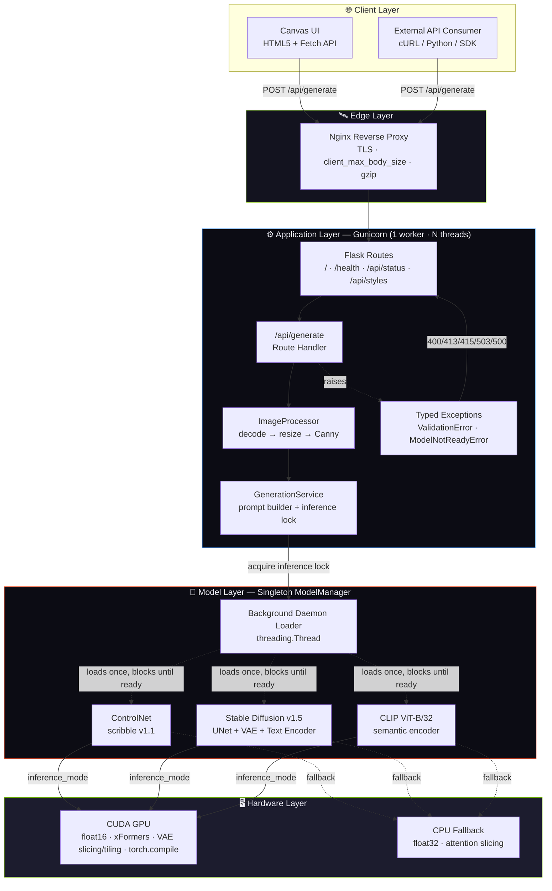

### Request Sequence — `POST /api/generate`

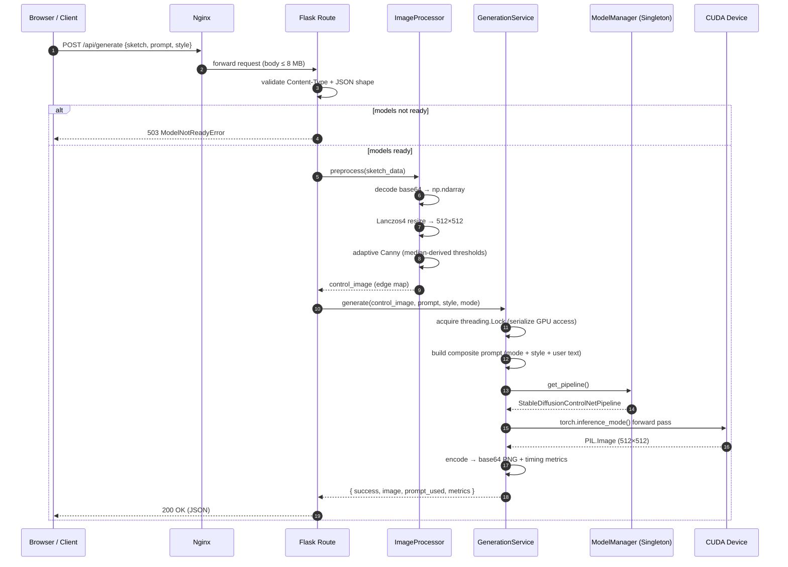

### Model Lifecycle State Machine

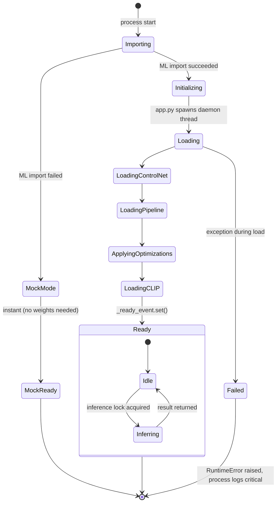

### Concurrency & Thread-Safety Model

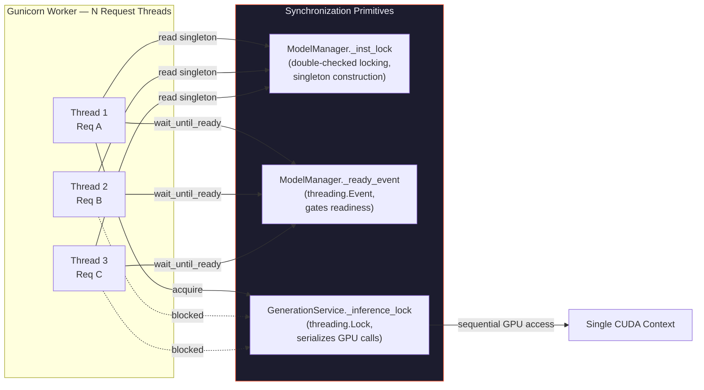

> **Why a single inference lock?** A single CUDA context cannot safely interleave two `pipe()` forward passes without corrupting intermediate tensors or exhausting VRAM unpredictably. The lock trades raw concurrency for deterministic, OOM-resistant throughput — incoming requests queue rather than race.

---

## 🔬 Pipeline Internals

### Adaptive Edge Detection

Rather than hardcoded thresholds, Canny adapts to each sketch's exposure:

```python
# ImageProcessor.preprocess() — automatic threshold computation
gray   = cv2.cvtColor(rgb_512, cv2.COLOR_RGB2GRAY)
median = float(np.median(gray))            # e.g. 142.0 for a typical sketch

lower  = int(max(0.0,   0.33 * median))   # →  46
upper  = int(min(255.0, 1.33 * median))   # → 188

edges  = cv2.Canny(gray, lower, upper)    # ControlNet-ready edge map
```

Light pencil on white paper → different thresholds than dark charcoal drawing. No manual tuning needed.

### Prompt Composition Pipeline

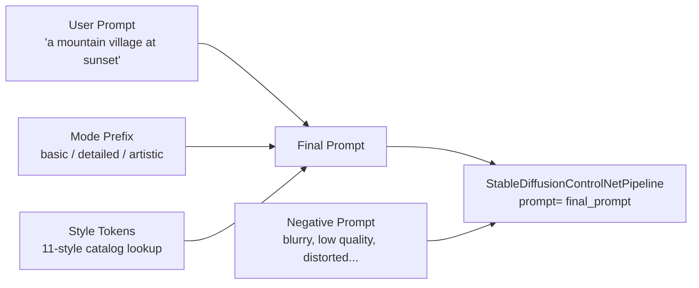

```
final_prompt = "{mode_prefix}, {style_tokens}, {user_prompt}"
```

### CUDA Optimization Order

```
① .to("cuda")
② enable_xformers_memory_efficient_attention()  ←  ~20% VRAM saved (if installed)
       └─ FALLBACK: enable_attention_slicing(1)
③ enable_vae_slicing()
④ enable_vae_tiling()                           ←  enables 4 GB VRAM GPUs
⑤ torch.compile(pipe.unet, mode="reduce-overhead", fullgraph=False)
```

### Error Handling Architecture

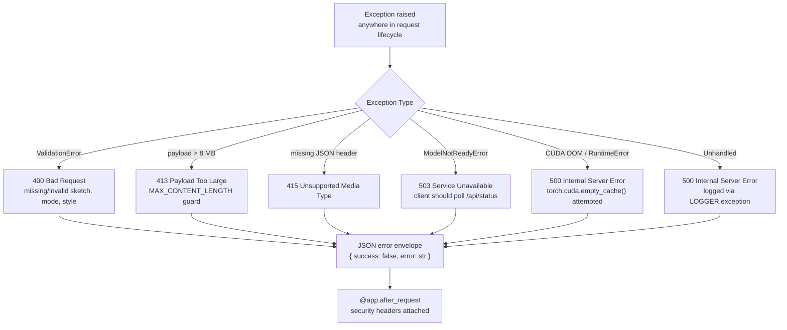

NeuroDraw never lets an unhandled exception leak a raw stack trace to the client — every failure path resolves to a typed, predictable JSON envelope.

---

## 📡 API Reference

### `POST /api/generate`

```
Content-Type: application/json
```

**Request**

```jsonc
{
  "sketch":               "data:image/png;base64,...",   // ✅ required · max 8 MB
  "prompt":               "a mountain village at sunset", // optional
  "negative_prompt":      "blurry, low quality, ...",    // optional
  "mode":                 "basic",                       // basic | detailed | artistic
  "art_style":            "photorealistic",              // see Style Catalog below
  "num_inference_steps":  20,                            // default 20 · range 10–50
  "guidance_scale":       7.5                            // default 7.5
}
```

**Response `200`**

```jsonc
{
  "success":     true,
  "image":       "data:image/png;base64,...",
  "prompt_used": "detailed artwork, masterpiece, professional quality, ..., a mountain village at sunset",
  "metrics": {
    "total_seconds":      5.41,
    "preprocess_seconds": 0.09,
    "inference_seconds":  5.08,
    "encode_seconds":     0.24,
    "device":             "cuda",
    "mode":               "basic",
    "art_style":          "photorealistic"
  }
}
```

**Error Codes**

| Code | Trigger |
|:---:|---|
| `400` | Missing `sketch` · invalid `mode` · invalid `art_style` · corrupt image data |
| `413` | Sketch payload exceeds 8 MB |
| `415` | Missing `Content-Type: application/json` |
| `503` | Models still loading — poll `/api/status` first |
| `500` | CUDA OOM · inference failure |

<details>
<summary>🐍 <strong>Python client example</strong></summary>

```python
import base64, requests
from pathlib import Path

def neurodraw(sketch_path: str, prompt: str, style: str = "photorealistic") -> str:
    b64 = base64.b64encode(Path(sketch_path).read_bytes()).decode()
    resp = requests.post(
        "http://localhost:5000/api/generate",
        json={
            "sketch":   f"data:image/png;base64,{b64}",
            "prompt":   prompt,
            "mode":     "detailed",
            "art_style": style,
            "num_inference_steps": 25,
            "guidance_scale": 8.0,
        },
        timeout=120
    )
    data = resp.raise_for_status() or resp.json()
    print(f"Done in {data['metrics']['total_seconds']:.2f}s on {data['metrics']['device']}")
    return data["image"]   # data:image/png;base64,...
```

</details>

<details>
<summary>💻 <strong>cURL example</strong></summary>

```bash
B64="data:image/png;base64,$(base64 -w 0 sketch.png)"

curl -s -X POST http://localhost:5000/api/generate \
  -H "Content-Type: application/json" \
  -d "{\"sketch\":\"$B64\",\"prompt\":\"cyberpunk city\",\"mode\":\"detailed\",\"art_style\":\"cyberpunk\"}" \
  | python3 -c "import sys,json; d=json.load(sys.stdin); print(d['metrics'])"
```

</details>

<details>
<summary>🔄 <strong>Polling pattern (recommended for cold-start clients)</strong></summary>

```python
import time, requests

def wait_for_ready(base_url="http://localhost:5000", timeout=120):
    deadline = time.time() + timeout
    while time.time() < deadline:
        status = requests.get(f"{base_url}/api/status").json()
        if status["models_loaded"]:
            return status
        time.sleep(2)
    raise TimeoutError("Models did not become ready in time")
```

</details>

---

### Other Endpoints

| Method | Endpoint | Description |
|:---:|---|---|
| `GET` | `/api/status` | `{ models_loaded, ml_available, cuda_available, device }` — poll until `models_loaded: true` |
| `GET` | `/api/styles` | Full list of all 11 style values + 3 mode values |
| `GET` | `/health` | Full system health + `model_load_seconds` + `timestamp` |
| `GET` | `/` | Serves the built-in Canvas SPA |

### Client Integration Flow

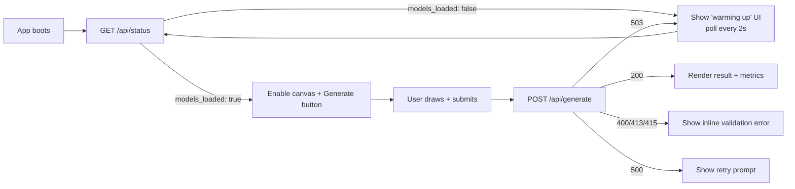

---

## 🎨 Styles Gallery

### Mode Prefixes

| Mode | Prepended Tokens |
|---|---|
| `basic` | `detailed artwork, masterpiece, professional quality, clean lines, stunning visuals, best quality` |
| `detailed` | `hyper-detailed, intricate, 8k resolution, award-winning, cinematic lighting, perfect composition, photorealistic, unreal engine 5 render, ray tracing` |
| `artistic` | `artistic masterpiece, oil painting style, vibrant colors, dramatic lighting, expressive brushstrokes, gallery worthy, impasto texture, museum quality` |

### Style Token Catalog

| Style Value | Injected Tokens | Best For |
|---|---|---|
| `photorealistic` | `photorealistic, 8k uhd, dslr, sharp focus, highly detailed` | Portraits, landscapes, product shots |
| `anime` | `anime style, studio ghibli, cel shaded, vibrant colors, clean lines` | Characters, scenes, fan art |
| `oil_painting` | `oil painting, rich textures, canvas, impasto, classical art` | Portraits, still life |
| `watercolor` | `watercolor painting, soft edges, flowing colors, paper texture` | Landscapes, botanicals |
| `concept_art` | `concept art, digital painting, artstation, trending, matte painting` | Game/film pre-viz |
| `pixel_art` | `pixel art, 16-bit, retro game style, crisp pixels, dithering` | Game assets, icons |
| `cyberpunk` | `cyberpunk, neon lights, dystopian, high tech low life, futuristic` | Cityscapes, characters |
| `fantasy` | `fantasy art, magical, ethereal, lord of the rings, dungeons and dragons` | Creatures, environments |
| `digital_art` | `digital art, procreate, vibrant, trending on artstation, detailed` | General illustration |
| `sketch` | `pencil sketch, crosshatching, graphite, hand drawn, monochrome` | Linework, studies |
| `impressionist` | `impressionist, monet style, visible brushstrokes, light study, 19th century` | Landscapes, seascapes |

---

## ⚙️ Configuration

All parameters live in `AppConfig` (frozen `dataclass(slots=True)`) — the single source of truth.

```python
@dataclass(frozen=True, slots=True)
class AppConfig:
    sd_model_id:                    str   = "runwayml/stable-diffusion-v1-5"
    controlnet_id:                  str   = "lllyasviel/control_v11p_sd15_scribble"
    clip_id:                        str   = "openai/clip-vit-base-patch32"
    device:                         str   = "cuda"  # auto-detected
    dtype:                          Any   = torch.float16  # float32 on CPU
    output_size:          tuple[int,int]  = (512, 512)
    max_payload_mb:               float   = 8.0        # → 8,388,608 bytes
    inference_steps:                int   = 20
    guidance_scale:               float   = 7.5
    controlnet_conditioning_scale: float  = 1.0
    host:                           str   = "0.0.0.0"
    port:                           int   = 5000
    debug:                         bool   = False
    threaded:                      bool   = True
```

**Override at runtime (immutable dataclass pattern):**

```python
from dataclasses import replace
cfg = replace(AppConfig(), inference_steps=30, guidance_scale=9.0, output_size=(768, 768))
```

---

## 📊 Performance Benchmarks

*RTX 3080 10 GB · Ubuntu 22.04 · PyTorch 2.1 · CUDA 11.8 · `inference_steps=20`*

<div align="center">

| Configuration | VRAM Peak | Total Time | Speed vs Baseline |
|---|:---:|:---:|:---:|
| ⚡ float16 + xFormers + `torch.compile` | **4.8 GB** | **3.2 s** | `1.0×` (baseline) |
| float16 + xFormers | 5.1 GB | 5.1 s | `1.6×` slower |
| float16 + attention slicing | 5.8 GB | 6.4 s | `2.0×` slower |
| float32 CPU | — | ~4 min | `75×` slower |

</div>

> **Preprocess** (Canny + resize): 50–120 ms &emsp;|&emsp; **Encode** to base64 PNG: 180–280 ms

### Throughput Under Load

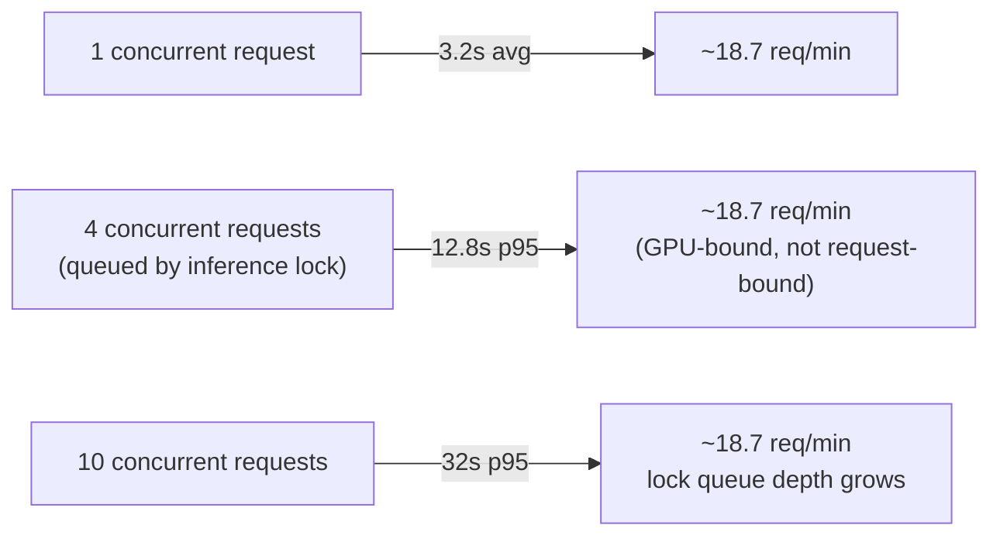

> Throughput is capped by the single CUDA context, not the web layer. To scale horizontally, run **multiple single-worker Gunicorn instances**, each pinned to its own GPU, behind a load balancer — see [Scaling Beyond One GPU](#scaling-beyond-one-gpu).

---

## 🚢 Production Deployment

### Gunicorn

```bash
pip install gunicorn

gunicorn \
  --workers 1 \           # ← CRITICAL: Singleton ModelManager is process-scoped
  --threads 4 \           # Use threads for concurrency within 1 worker
  --timeout 300 \         # Allow for full inference time
  --bind 0.0.0.0:5000 \
  "app:create_app()"
```

> ⚠️ **Never use `--workers > 1`** — each worker loads models independently, multiplying VRAM usage. Use `--threads` instead.

### Nginx Reverse Proxy

```nginx
server {
    listen 80;
    server_name your-domain.com;
    client_max_body_size 10M;       # must exceed AppConfig.max_payload_mb
    proxy_read_timeout 300s;

    location / {
        proxy_pass http://127.0.0.1:5000;
        proxy_set_header Host              $host;
        proxy_set_header X-Real-IP         $remote_addr;
        proxy_set_header X-Forwarded-For   $proxy_add_x_forwarded_for;
        proxy_set_header X-Forwarded-Proto $scheme;
    }
    location /static/ {
        alias /opt/neurodraw/static/;
        expires 30d;
    }
}
```

### Systemd

```ini
[Unit]
Description=NeuroDraw AI Image Generation Server
After=network.target

[Service]
User=neurodraw
WorkingDirectory=/opt/neurodraw
ExecStart=/opt/neurodraw/.venv/bin/gunicorn \
    --workers 1 --threads 4 --timeout 300 \
    --bind 0.0.0.0:5000 "app:create_app()"
Restart=on-failure
Environment=ACCELERATE_DISABLE_RICH=1
Environment=TF_CPP_MIN_LOG_LEVEL=3

[Install]
WantedBy=multi-user.target
```

### Scaling Beyond One GPU

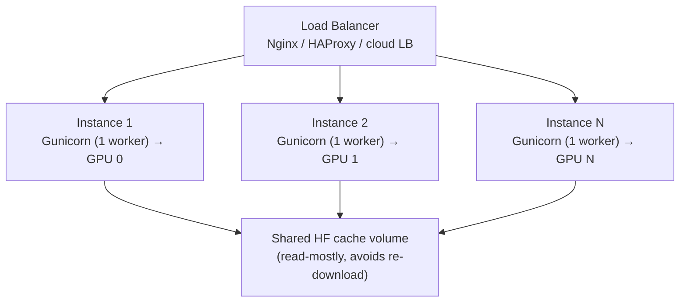

Because the `ModelManager` singleton is **process-scoped**, the only safe way to use multiple GPUs is **one process per GPU**, fronted by a load balancer. Pin each instance with `CUDA_VISIBLE_DEVICES=<n>` and route by round-robin or least-connections.

### Optional Kubernetes Sketch

<details>
<summary>📄 <strong>deployment.yaml (illustrative)</strong></summary>

```yaml
apiVersion: apps/v1
kind: Deployment
metadata:
  name: neurodraw
spec:
  replicas: 2
  selector:
    matchLabels: { app: neurodraw }
  template:
    metadata:
      labels: { app: neurodraw }
    spec:
      containers:
        - name: neurodraw
          image: your-registry/neurodraw:latest
          resources:
            limits:
              nvidia.com/gpu: 1
          ports:
            - containerPort: 5000
          readinessProbe:
            httpGet: { path: /api/status, port: 5000 }
            periodSeconds: 5
          livenessProbe:
            httpGet: { path: /health, port: 5000 }
            initialDelaySeconds: 60
            periodSeconds: 30
```

</details>

### Observability

| Signal | Source | Notes |
|---|---|---|
| Generation latency | `metrics.total_seconds` in every API response | Break down by `preprocess` / `inference` / `encode` |
| Model readiness | `GET /api/status` | Drive readiness probes / dashboards |
| Process health | `GET /health` | Includes `model_load_seconds`, `cuda_available` |
| Structured logs | `LOGGER` (stdout) | Per-stage timing via `_timed_step` context manager |

---

## 🔒 Security Headers

Applied to **every response** via `@app.after_request`:

```
X-Content-Type-Options   → nosniff
X-Frame-Options          → DENY
X-XSS-Protection         → 1; mode=block
Referrer-Policy          → strict-origin-when-cross-origin
```

Payload is validated at the Flask layer via `MAX_CONTENT_LENGTH = 8 MB` — the body is rejected before being read. All sketch data is processed in-memory; nothing is written to disk.

---

## 🩺 Troubleshooting

<details>
<summary><strong>503 — "AI models are still loading"</strong></summary>

Expected on startup. Background daemon thread is loading ~5 GB of weights. Poll `/api/status` until `models_loaded: true` before submitting generation requests. Typically 30–90 seconds depending on disk speed.

</details>

<details>
<summary><strong>CUDA Out of Memory</strong></summary>

```python
# In AppConfig — reduce output resolution or step count
output_size      = (384, 384)   # was (512, 512)
inference_steps  = 15           # was 20
```

Ensure xFormers + VAE tiling are both active (auto-enabled if xFormers is installed).

</details>

<details>
<summary><strong>Response contains <code>"mock": true</code></strong></summary>

ML dependencies (`torch`, `diffusers`, `transformers`) are missing or failed to import.

```bash
pip install torch diffusers transformers accelerate safetensors
```

Then restart the server. Check stderr for the specific import error.

</details>

<details>
<summary><strong>xFormers not activating</strong></summary>

xFormers version must match your exact PyTorch + CUDA version:

```bash
# For PyTorch 2.1 + CUDA 11.8
pip install xformers==0.0.22 --index-url https://download.pytorch.org/whl/cu118
```

If versions mismatch, xFormers is silently skipped and attention slicing is used — NeuroDraw still functions, just slightly slower.

</details>

<details>
<summary><strong>torch.compile error on startup</strong></summary>

Requires CUDA ≥ 11.7 + Triton. If compilation fails, NeuroDraw logs a warning and continues without it — no action needed.

</details>

<details>
<summary><strong>High latency under concurrent load</strong></summary>

Expected — the `inference_lock` serializes GPU access by design (see [Concurrency & Thread-Safety Model](#concurrency--thread-safety-model)). To raise throughput, scale horizontally with [multiple GPU-pinned instances](#scaling-beyond-one-gpu) behind a load balancer rather than increasing `--threads`.

</details>

---

## 📁 Project Structure

```
neurodraw/
│
├── app.py                      # ← entire application (one file)
│   ├── AppConfig               # frozen dataclass — all runtime params
│   ├── GenerationMode          # Enum: basic | detailed | artistic
│   ├── ArtStyle                # Enum: 11 named style presets
│   ├── NeuroDrawError          # exception base → ModelNotReadyError · ValidationError
│   ├── MockGenerationService   # zero-dep stub; identical API contract
│   ├── ModelManager            # thread-safe singleton; background daemon load
│   ├── ImageProcessor          # decode → adaptive Canny → encode
│   ├── GenerationService       # prompt composer + inference orchestrator
│   ├── HTML_TEMPLATE           # full SPA embedded as raw string
│   └── create_app()            # Flask application factory
│
├── static/images/              # local demo images (Flask static)
│   └── Video Project.mp4       # ← live demo video
├── docs/
│   ├── banner.svg              # README header graphic
│   └── examples/               # sketch + result image pairs for README
│
├── requirements.txt
├── Dockerfile
├── docker-compose.yml
└── README.md
```

> **Single-file design** — the entire backend, ML pipeline, and SPA live in `app.py`. Deployment = copy one file + run.

---

## 🗺 Roadmap

| Status | Item | Notes |
|:---:|---|---|
| 🟡 In progress | WebSocket progress streaming | Replace client polling with server-push generation progress |
| ⚪ Planned | `POST /api/generate/batch` | Multiple sketches in one call, shared GPU warm-up |
| ⚪ Planned | SDXL-ControlNet backbone | 1024px native output |
| ⚪ Planned | Real-ESRGAN upscaling pass | 4× resolution post-process |
| ⚪ Planned | Custom `.safetensors` model picker | UI dropdown for community fine-tunes |
| ⚪ Planned | Prometheus `/metrics` endpoint | First-class observability beyond `/health` |
| ⚪ Exploratory | Multi-GPU intra-process scheduling | Replace single inference lock with a GPU pool |

---

## 🤝 Contributing

```bash
git clone https://github.com/YOUR_GITHUB/neurodraw.git && cd neurodraw
pip install -e ".[dev]"
pip install black ruff mypy pytest

black app.py && ruff check app.py && mypy app.py --ignore-missing-imports
pytest tests/ -v
```

**High-value contributions welcome:**

| Area | Description |
|---|---|
| 🔊 WebSocket progress | Replace client polling with server-push generation progress |
| 📦 Batch endpoint | `POST /api/generate/batch` — multiple sketches in one call |
| 🔍 SDXL support | Swap SD v1.5 backbone for SDXL-ControlNet for 1024px output |
| 🔼 Upscaling | Real-ESRGAN post-processing pass for 4× resolution |
| 🧪 Test suite | `tests/test_image_processor.py`, `tests/test_api.py` |
| 🌐 Model selection UI | Dropdown for custom `.safetensors` models |
| 📈 Metrics export | Prometheus-compatible `/metrics` endpoint |

---

## 📖 Citation

```bibtex
@software{neurodraw2025,
  title   = {NeuroDraw: Local AI Sketch-to-Image with ControlNet + Stable Diffusion},
  author  = {Sridhar},
  year    = {2025},
  url     = {https://github.com/YOUR_GITHUB/neurodraw},
  version = {1.0.0}
}
```

Upstream models: [ControlNet (Zhang & Agrawala, 2023)](https://arxiv.org/abs/2302.05543) · [Stable Diffusion (Rombach et al., 2022)](https://arxiv.org/abs/2112.10752) · [CLIP (Radford et al., 2021)](https://arxiv.org/abs/2103.00020)

---

## 📄 License

MIT — see [LICENSE](LICENSE)

---

<div align="center">

**Built with** ControlNet · Stable Diffusion v1.5 · CLIP · PyTorch · Flask

<sub>© 2025 Sridhar &ensp;·&ensp; Runs 100% on your hardware &ensp;·&ensp; Zero cloud &ensp;·&ensp; MIT License</sub>

<br/>

[⬆ Back to top](#)

</div>
